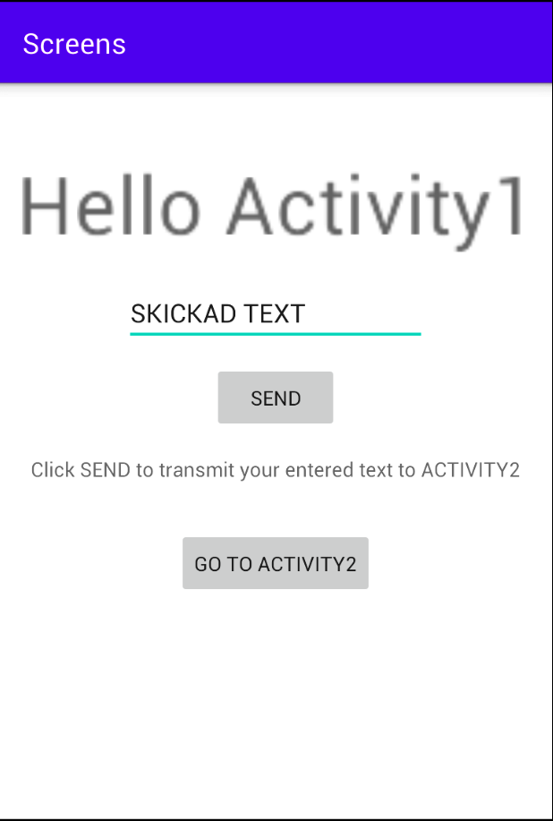
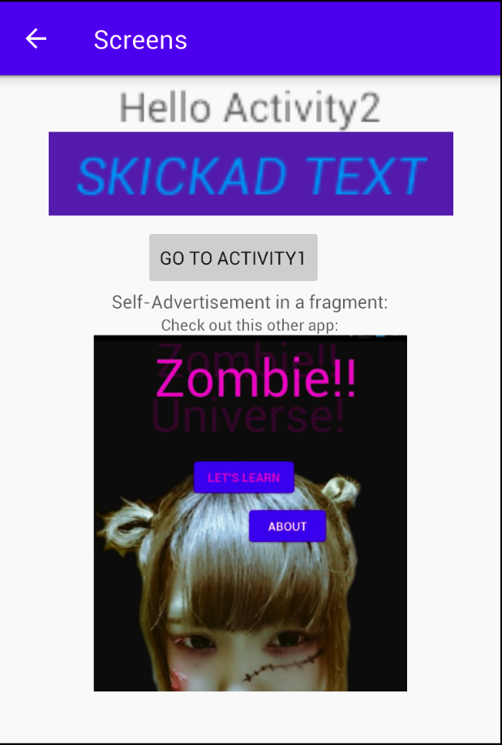

# Rapport

Rapporten följer instruktionerna som fanns till uppgiften.

#Add a second activity
#Add a button in the first activity that starts the second activity

La till en andra aktivitet vid namn "MainActivity2" och länkade denna från MainActivity1 via:

```
public class MainActivity extends AppCompatActivity {
    (...)
    /** Called when the user taps the Act2Button */
    public void GoToAct2(View view) {
        Intent intent = new Intent(this, MainActivity2.class);
        startActivity(intent);
    }
}
```

Det går även att skriva in ett meddelande i textrutan som när man klickar på "SEND"-knappen
skickas till och skrivs ut i Activity2.

```
public class MainActivity extends AppCompatActivity {
    public static final String EXTRA_MESSAGE = "com.example.myfirstapp.MESSAGE";
    @Override
    (..)

    /** Called when the user taps the Send button */
    public void sendMessage(View view) {
        Intent intent = new Intent(this, MainActivity2.class);
        EditText editText = (EditText) findViewById(R.id.editText);
        String message = editText.getText().toString();
        intent.putExtra(EXTRA_MESSAGE, message);
        startActivity(intent);
    }
```

Kortfattat så skapas en (text)sträng ('EXTRA_MESSAGE') i vilken vi placerar innehållet
som matas in i textfältet ('editText').
Denna (text)sträng hämtas sedan i MainActivity2, här är koden för det (från MainActivity2):

```
        // Get the Intent that started this activity and extract the string
        Intent intent = getIntent();
        String message = intent.getStringExtra(MainActivity.EXTRA_MESSAGE);

        // Capture the layout's TextView and set the string as its text
        TextView textView = findViewById(R.id.textView);
        textView.setText(message);
```

Referens: https://developer.android.com/training/basics/firstapp/starting-activity#BuildIntent

#- Add a fragment in the second activity that contains at least one widget

Jag hade egentligen planerat att lägga till en annan funktion men det var lite strul med
den så jag satsade på att göra det simplaste: ett fragment med en imageview.
Denna lades helt enkelt till enligt dugga-instruktionen (högerklick) New->Fragment->Fragmnet (Blank).
När väl denna lagts till kunde innehåll läggas till inuti den.
Jag lade till en ConstraintLayout och inuti den en textview och som redan nämnts en ImageView
med en bild från mitt projekt (denna dugga skickas in efter projektet avslutats).

Detta fragment placerades sedan i activity_main2.xml:

```
    <fragment
        android:name="com.example.screens.BlankFragment"
        android:layout_width="244dp"
        android:layout_height="289dp"
        android:tag="blank_fragment"
        app:layout_constraintEnd_toEndOf="parent"
        app:layout_constraintStart_toStartOf="parent"
        app:layout_constraintTop_toBottomOf="@+id/textView5" />
```

Det är inte så mycket mer som finns i aktiviteten.
Man kan backa bakåt med hjälp av en knapp i MainActivity2.
Alternativt kan man även använda sig av "Up Navigation".
Denna deklarerades/lades till i AndroidManifest.xml:

```
<activity android:name=".MainActivity2">
            android:parentActivityName=".MainActivity">
            <!-- The meta-data tag is required if you support API level 15 and lower -->
            <meta-data
            android:name="android.support.PARENT_ACTIVITY"
            android:value=".MainActivity" />
</activity>
```

Referens: https://developer.android.com/training/appbar/up-action

#SCREENSHOTS

Här är två stycket skärmbilder från appen:


